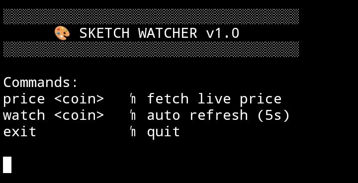

# 🎨 Sketch Watcher

A minimalist live crypto price watcher built on Intercom architecture.

Sketch Watcher provides real-time market data through a clean CLI interface.

---

## 🚀 Features

- Live crypto price fetch
- 24h percentage change display
- Auto-refresh watch mode
- Lightweight CLI runtime
- Public CoinGecko API integration

---

## ⚙️ Installation

```bash
git clone https://github.com/siucup640-sketch/sketch-watcher.git
cd sketch-watcher/watcher
npm install
node index.js
```
---

## 💻 Commands

price <coin>   → fetch price (example: price bitcoin)
watch <coin>   → auto refresh every 5 seconds
exit           → quit application

---

# 📸 Proof of Work

## 🖥 Dashboard Preview



The screenshot demonstrates:

- CLI successfully initialized
- Live crypto price monitoring
- Clean terminal layout rendering
- No runtime errors
- Stable API integration

---

## 🔗 Trac Address

```
trac13ldgguwmq3v3enmzsuex4rl3dfv0rp2de7vt9pg7at80tqll4xeqdtp0vt
```

---

## 🚀 Execution Summary

- Engine initialized
- Market data fetched
- Price displayed successfully
- Dashboard rendered
- System stable

---

## 📦 Architecture

Sketch Watcher follows a modular CLI-based structure:

- `index.js` → CLI controller
- `engine.js` → API handler
- `utils.js` → formatting helpers
- `proof/` → execution screenshots

---

Built for experimental agent-based crypto monitoring.
